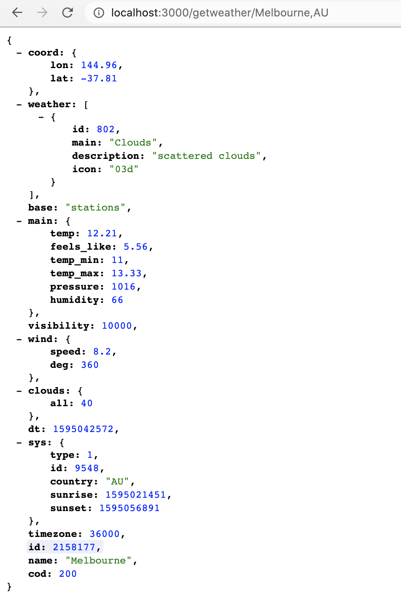

# WeatherAPI_CI_AWS
A small Express.js API endpoint that takes in a URL parameter of City and Country Code (eg. "AU") and fetches data from https://openweathermap.org/api in JSON Format.

### Purpose
The purpose of this repository is to explain how easy it is to interface with a 3rd party API using Express and deploy it to AWS using Docker and Elastic Container Registry (ECR).

### Architecture
The architecture is fairly simple using Express as our main API and Redis as a means of collecting usage metrics. We colelct the metrics to determine how often the endpoint is being accessed and what is the most common weather location requested.

### Run
 #### Using Docker
  - create a .env file in the root of the project
  - Add a variable "API_KEY" from the api resource with your generated api key
  - Add a variable "PORT" with the port you wish to run your application (3000)
  - Add a variable "UNITS" with the type of tempreature measurement you wish to recieve in the api response (metric)
  - run `Docker-compose up -d` to run the application
### Example Output
You will end up with the following result. Notice in the URL, we pass in the city name and its country code. These are the dynamic url paramaters that the open weather api uses to look up the correct weather. If we didnt supply the country code, Melbourne would return as a city in the United States which is not desired.

  

 

